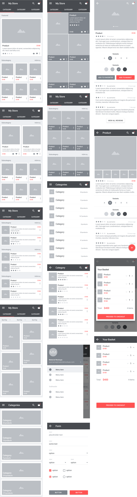

# E-Commerce

In this android application, we tried to implement activities for the below mockup screens for an E-commerce application. This application is develop during Summer 2016 as an internship project.

#Contributors

[Volkan Şahin](https://github.com/volsahin)

[Musa Çıbık](https://github.com/musacibik)

[Mert Bulut](https://github.com/mrtblt)

[Gizem Ilgar](https://github.com/gzmilgar)

[Mustafa Kuloğlu](https://github.com/mustafakuloglu)

[Cömert Baldemir](https://github.com/Cbaldemir)

